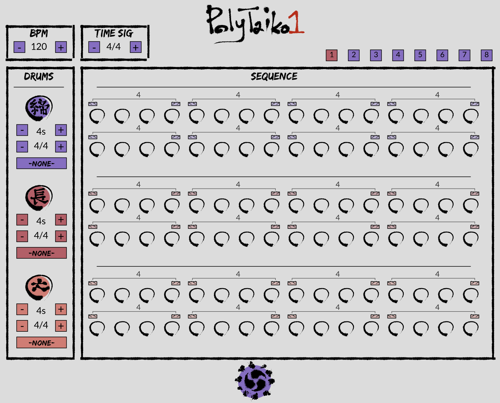

<h1 align="center">Poly-Taiko-1</h1>

  

<h2 align="center">A browser-based beat sequencer for taiko ensemble</h2>

  
  

The [Poly-Taiko-1](https://mathewkramer.io/Poly-Taiko-1) (a play on Roland's Taiko-1 electronic taiko) provides a browser-based playground for exploring taiko instruments and rhythms, composing music for taiko ensemble, or just plain messing around.

<h3 align="center"><a href="https://mathewkramer.io/Poly-Taiko-1/">Make some beats!</a></h3>

## About

*Kumidaiko* (組み太鼓) is the art of Japanese ensemble drumming. Although *taiko* (drums) themselves have been used for centuries in traditional Japanese music, such as during festivals or within Buddhist temples, group taiko performances are a relatively new art form, having begun around the 1950s and 60s. Japanese-Americans have been an integral part of taiko performance and culture from its inception, and today there are groups all across North America. (There may even be some near you!)
  
Taiko rhythms have historically been passed down orally, though it is becomming more common to transcribe them with Western music notation. The Poly-Taiko-1 provides a hybrid, allowing taiko rhythms to be developed through sound (and including common *kuchishouka* (口唱歌), or vocalizaitons, in its visualization), while also including some advanced musical features that are remiscient of written music, wrapped up into a beat-sequencer-like interface.

The Poly-Taiko-1 relies on [p5js](https://p5js.org) for graphics and sound playback.

## Updates

### Releases

- 1.0.0: Initial release (22/10/31)
- 2.0.0: Multi-pattern interface with presets (22/11/06)

### Roadmap

- Presets for different time signatures
- Proper odaiko recordings
- Advanced/basic interface toggle

## Contributing

Feel free to submit an issue or pull request if you notice any bugs or would like to request a feature!
